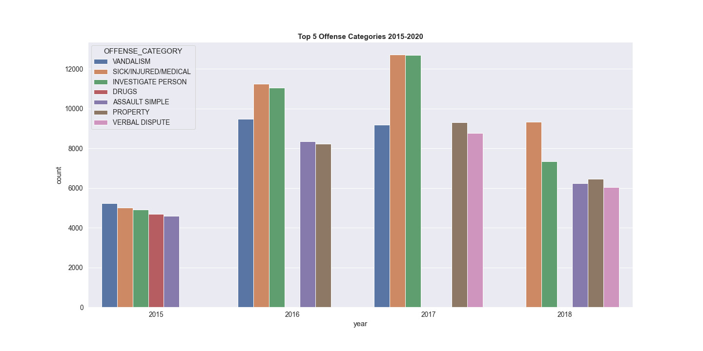
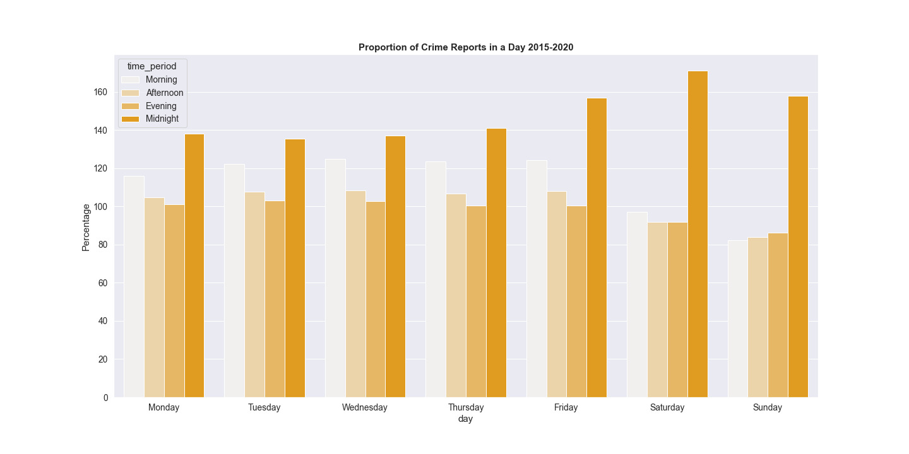

# Boston-Safety-Meter (Built using Python, CSS, HTML)

## Introduction
Neighborhood safety is a must when determining a location to buy a house. People who are making a move to Boston would likely use this application. We can check if the crime committed in the area is a petty or a serious crime. Crime is a problem in the urban setting in America. Primary task is to classify crimes according to the day. Another functionality being classifying the areas as being safe/unsafe based on the seriousness of the crime

## Uses
* Check whether a crime committed in the area is a petty or serious crime

* Maps to check which areas in Boston have a high crime rate

* Graph plots based on the data

## Installation
* Flask
* Pandas
* Numpy
* Matplotlib

## Built With
* Python
* Html
* CSS

## Working
* Flask has been used to make a web application 

* UI has been designed using HTML/CSS

* The coding environment is in python

* Making use of the time of the day (morning, evening, night), the area , the areas have been classified

## Developers
* Dylan Dias - @dylandias99 - https://github.com/dylandias99
* Aishwariya Lad
* Aniket Tikotkar 

## Screenshots
### Web Interface:

## Offence Graphs

